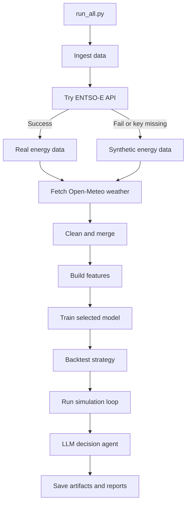

# AI-Powered Energy Trading (Beginner Friendly)

This project is a full **end-to-end data science workflow** that looks like what an energy trading team might use in production.

It takes market and weather data, builds features, trains forecasting models, backtests a trading strategy, runs a simulation loop, and finally asks an LLM for a decision with a safe fallback.
You can run everything from a Streamlit dashboard (recommended) or the terminal.

## 1) Simple Project Explanation

Think of this as a smart pipeline:

1. Get energy + weather data
2. Clean and merge data
3. Create forecasting features
4. Train a selected model (XGBoost, LSTM, or Prophet) for demand and renewables
5. Backtest a trading strategy
6. Simulate real-time predictions
7. Ask an LLM for a trade decision

## 2) Visual Pipeline Flow



## 3) Step-By-Step Setup

### Step A: Create a virtual environment

```bash
python -m venv .venv
```

Activate it:

- Windows PowerShell: `.venv\\Scripts\\Activate.ps1`
- macOS/Linux: `source .venv/bin/activate`

### Step B: Install dependencies

```bash
pip install -r requirements.txt
```


### Step C: Set environment variables

1. Copy `.env.example` to `.env`
2. Fill in:
   - `ENTSOE_API_KEY`
   - `HF_TOKEN`

If `ENTSOE_API_KEY` is missing or ENTSO-E fails, the system auto-switches to synthetic energy data.
If `HF_TOKEN` is missing or Hugging Face fails, the system auto-switches to deterministic fallback decisions.

## 4) How To Run

### Option A (Recommended): Streamlit dashboard

```bash
streamlit run dashboard/app.py
```

In the dashboard you can select:
- Region (`DE_LU`, `FR`, `NL`)
- Training window (`90`, `180`, `365` days)
- Model (`xgboost`, `lstm`, `prophet`)
- Simulation horizon

Then click **Run Pipeline**.

The dashboard surfaces the latest model-driven action (`LONG`, `SHORT`, or `HOLD`) together with the predicted market price in `EUR/MWh`.

### Option B: Terminal

Run full pipeline:

```bash
python -m scripts.run_all --lookback-days 180 --zone DE_LU --model xgboost --simulation-horizon 24
```

## 5) Project Structure

```text
src/
  config.py
  data_sources/
    entsoe_client.py
  data_pipeline/
    ingest.py
    clean.py
    merge.py
    run_pipeline.py
  features/
    build_features.py
  models/
    model_registry.py
    base.py
    train_xgb.py
    train_lstm.py
    train_prophet.py
  trading/
    backtest.py
  simulation/
    realtime_loop.py
  agents/
    llm_utils.py
    decision_agent.py
    prompts.py
scripts/
  run_all.py
dashboard/
  app.py
  charts.py
data/
  raw/
  processed/
artifacts/
  models/
  simulation/
```

## 6) Data Flow

- `data/raw/energy_raw.csv` and `data/raw/weather_raw.csv` are created during ingestion.
- `data/processed/energy_weather_clean.csv` is created after cleaning/merging.
- `data/processed/features.csv` is created after feature engineering.
- `artifacts/models/*` stores trained model files.
- `artifacts/models/metrics_*.json` stores MAE/RMSE by model.
- `artifacts/simulation/backtest_metrics.json` stores trading metrics.
- `artifacts/simulation/simulation_log.jsonl` stores simulated live predictions.
- `artifacts/simulation/decision_report.json` stores final LLM/fallback decision.

## 7) Key Concepts Explained

- **Day-ahead price**: energy price for future delivery periods.
- **Demand forecast**: expected load in `kW`.
- **Renewable forecast**: expected renewable generation in `MW`.
- **Imbalance**: `predicted_demand - predicted_renewables` (converted units).
- **Walk-forward validation**: train on earlier time periods and test on later ones (time-safe).
- **Model selection**: choose one model per run (`xgboost`, `lstm`, `prophet`).
- **Backtest**: test strategy on historical data before live deployment.
- **LLM fallback**: deterministic logic keeps the system running if API fails.

## 8) Example Outputs

Example backtest metrics:

```json
{
  "sharpe_ratio": 0.82,
  "max_drawdown": -0.11,
  "hit_rate": 0.54,
  "total_pnl": 1325.44
}
```

Example decision report fields:

- `decision`: LONG / SHORT / HOLD
- `reasoning`: explanation text
- `risk_assessment`: risk note
- `confidence`: value between 0 and 1
- `source`: `huggingface` or `deterministic_fallback`

## 9) Troubleshooting

- **No ENTSO-E key or API error**: this is okay; synthetic mode is automatic.
- **No HF token or timeout**: this is okay; deterministic fallback is automatic.
- **Import errors**: confirm virtual environment is active and dependencies installed.
- **`Importing plotly failed. Interactive plots will not work.`**: reinstall dependencies with `pip install -r requirements.txt` inside the active virtual environment.
- **No output files**: check logs and confirm write permissions.
- **LSTM/Prophet install issues**: run `pip install -r requirements.txt` and ensure your Python version is compatible with `torch` and `prophet`.

## 10) How To Extend

- Add more markets/zones and compare model performance.
- Add battery/storage optimization logic.
- Add probabilistic forecasting (prediction intervals).
- Add portfolio constraints and risk limits.
- Replace prompt-only LLM with structured tool-calling.

## Environment Variables Summary

Secrets (never hardcode in code):

- `ENTSOE_API_KEY`
- `HF_TOKEN`

Optional:

- `HF_MODEL` (default: `Qwen/Qwen2.5-72B-Instruct`)
- `LOOKBACK_DAYS` (default: `180`)
- `ENTSOE_BIDDING_ZONE` (default: `DE_LU`)
